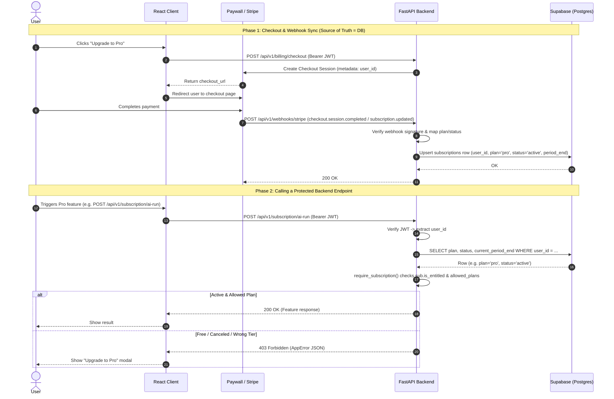
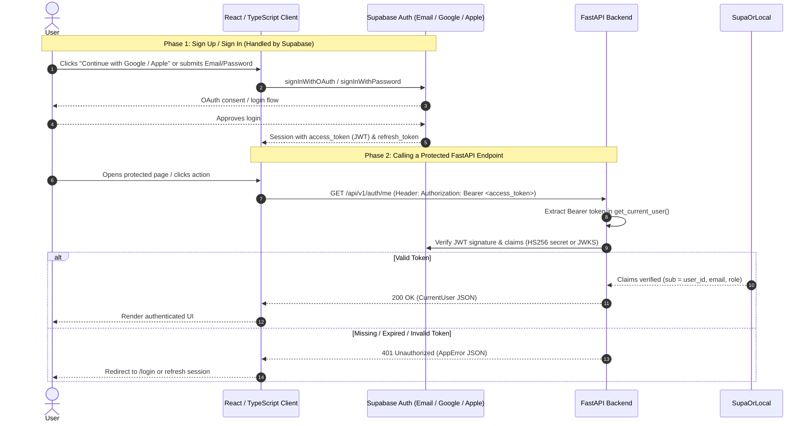

```mermaid
sequenceDiagram
    autonumber
    actor User
    participant FE as React Client
    participant Paywall as Paywall / Stripe
    participant BE as FastAPI Backend
    participant DB as Supabase (Postgres)

    Note over User,DB: Phase 1: Checkout & Webhook Sync (Source of Truth = DB)
    User->>FE: Clicks "Upgrade to Pro"
    FE->>BE: POST /api/v1/billing/checkout (Bearer JWT)
    BE->>Paywall: Create Checkout Session (metadata: user_id)
    Paywall-->>FE: Return checkout_url
    FE->>Paywall: Redirect user to checkout page
    User->>Paywall: Completes payment
    Paywall->>BE: POST /api/v1/webhooks/stripe (checkout.session.completed / subscription.updated)
    BE->>BE: Verify webhook signature & map plan/status
    BE->>DB: Upsert subscriptions row (user_id, plan='pro', status='active', period_end)
    DB-->>BE: OK
    BE-->>Paywall: 200 OK

    Note over User,DB: Phase 2: Calling a Protected Backend Endpoint
    User->>FE: Triggers Pro feature (e.g. POST /api/v1/subscription/ai-run)
    FE->>BE: POST /api/v1/subscription/ai-run (Bearer JWT)
    BE->>BE: Verify JWT -> extract user_id
    BE->>DB: SELECT plan, status, current_period_end WHERE user_id = ...
    DB-->>BE: Row (e.g. plan='pro', status='active')
    BE->>BE: require_subscription() checks sub.is_entitled & allowed_plans
    alt Active & Allowed Plan
        BE-->>FE: 200 OK (Feature response)
        FE-->>User: Show result
    else Free / Canceled / Wrong Tier
        BE-->>FE: 403 Forbidden (AppError JSON)
        FE-->>User: Show "Upgrade to Pro" modal
    end
```

```mermaid
sequenceDiagram
    autonumber
    actor User
    participant FE as React / TypeScript Client
    participant Supa as Supabase Auth (Email / Google / Apple)
    participant BE as FastAPI Backend

    Note over User,Supa: Phase 1: Sign Up / Sign In (Handled by Supabase)
    User->>FE: Clicks "Continue with Google / Apple" or submits Email/Password
    FE->>Supa: signInWithOAuth / signInWithPassword
    Supa-->>User: OAuth consent / login flow
    User-->>Supa: Approves login
    Supa-->>FE: Session with access_token (JWT) & refresh_token

    Note over FE,BE: Phase 2: Calling a Protected FastAPI Endpoint
    User->>FE: Opens protected page / clicks action
    FE->>BE: GET /api/v1/auth/me (Header: Authorization: Bearer <access_token>)
    BE->>BE: Extract Bearer token in get_current_user()
    BE->>Supa: Verify JWT signature & claims (HS256 secret or JWKS)
    alt Valid Token
        SupaOrLocal-->>BE: Claims verified (sub = user_id, email, role)
        BE-->>FE: 200 OK (CurrentUser JSON)
        FE-->>User: Render authenticated UI
    else Missing / Expired / Invalid Token
        BE-->>FE: 401 Unauthorized (AppError JSON)
        FE-->>User: Redirect to /login or refresh session
    end
```
